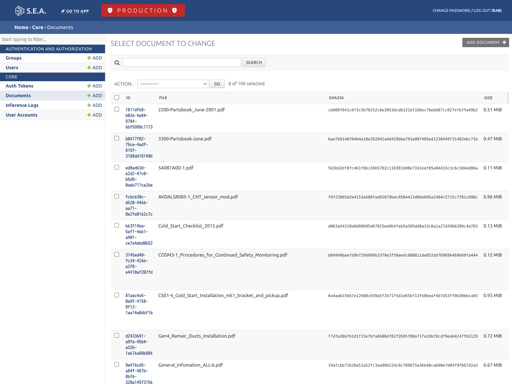
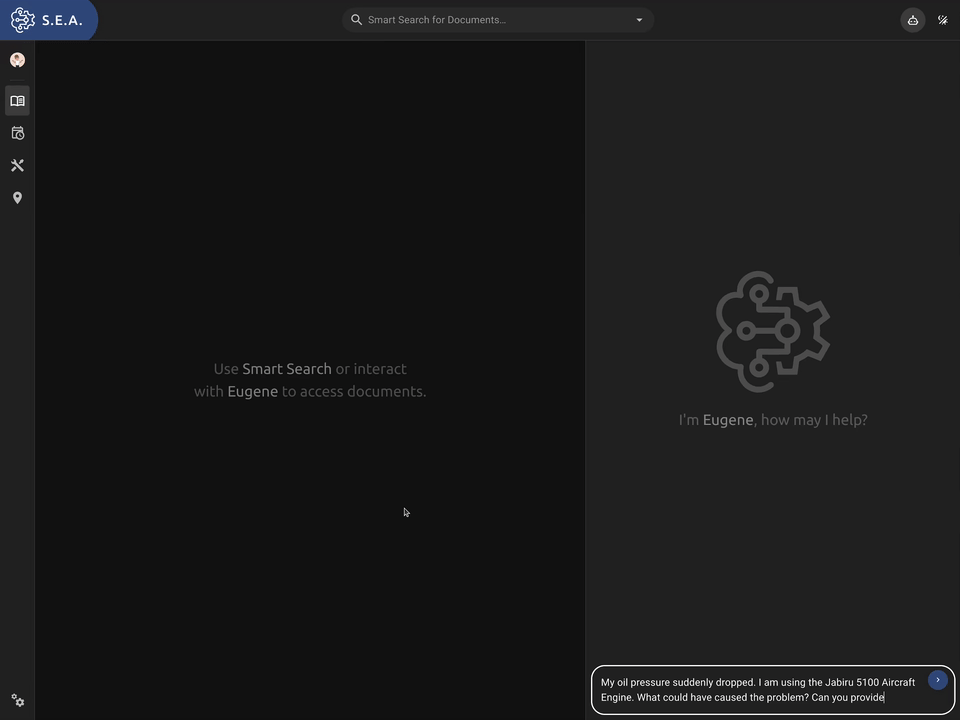
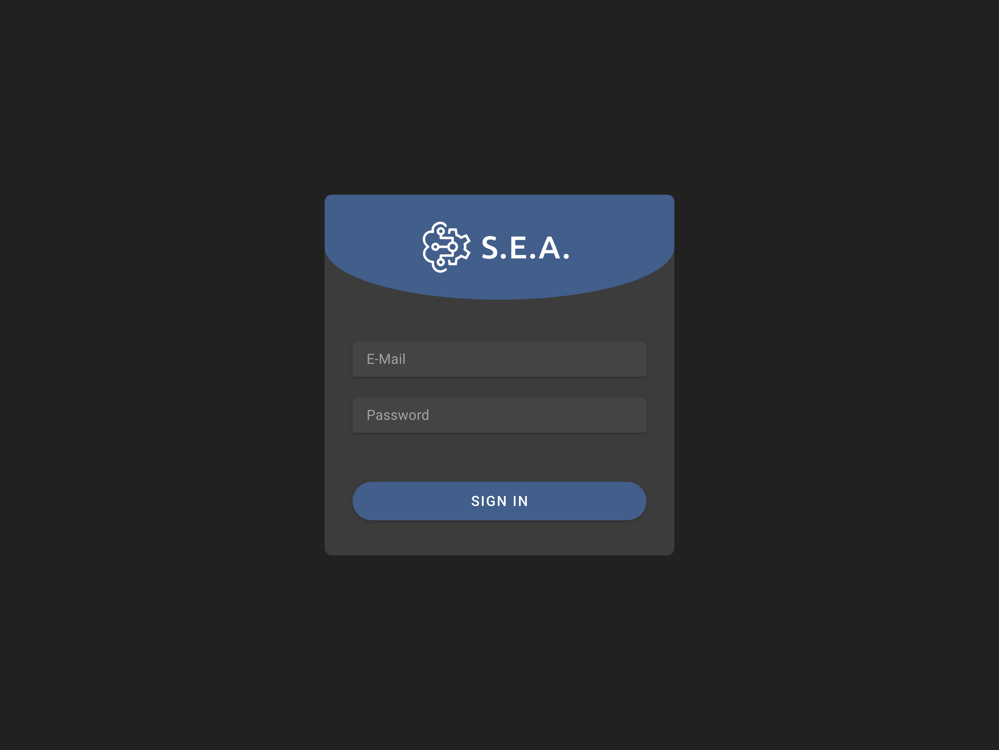
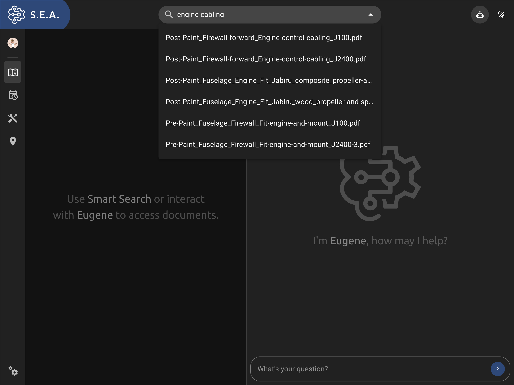

&nbsp;
&nbsp;

# S.E.A / Smart Engineering Assistant

The Central Information Hub that supports engineers in navigating the endless seas of technical documentation. Powered by the Databricks' LLMs and Vector Search.

## Inspiration

Engineers are often faced with a vast body of documentation applicable to their discipline. Not only can the sheer amount be overwhelming, but the information is often only available in *unstructured* formats such as PDFs, making it difficult for computers to parse, understand, and make searchable.

To further add to the problem, the documents may be revised frequently and are often of highly technical nature.

We were asking ourselves the question: "What could be done to make this information more accessible to humans and machines alike?"

For the purpose of this challenge, we focused on aviation and aircraft manufacturing. However, our solution is generally applicable for any discipline involving large amounts of documentation, such as accounting, law, software engineering, and so on.

Aviation and aircraft manufacturing are undeniably of tremendous importance to our lives.

The entire aviation industry is highly regulated and participates in a safety-first culture, resulting in an astonishingly low rate of accidents. However, one of the downsides is an enormous amounts of documentation to cover all requirements, procedures, checklists, etc.

We have worked towards a solution that makes documentation much more discoverable and accessible.

## What it does

S.E.A. and its AI-powered assistant Eugene are supercharged by Databricks Large Language Models and their Vector Search Indexing platform. The system is able to ingest, parse, aggregate, and index unstructured data such as PDF documents and makes them discoverable and accessible via generative AI.

## How we built it

### Databricks LLMs and Vector Search Index

Databricks' powerful generative AI capabilities have been utilized for the indexing and search part of the system, as well as for AI queries. The first step was ingesting thousands upon thousands of pages extracted from unstructured PDF documentation and manuals. This was achieved using the managed Spark environment's rapid parallelized data processing to extract text and important metadata, such as page numbers for each chunk of text that will be indexed. Once processing has been completed, we have set up the Retrieval Augmented Generation using Databricks' Vector Search Indexes and their hosted Large Language Models.

This setup turned out to work really well because it essentially became trivial to continuously ingest new or updated data.

### Server Back-End

A Django web server has been used to run the back-end and provide API access. The back-end itself is primarily responsible to connect the front-end application with Databricks' features, as well as providing user authentication and to manage and coordinate data ingestion.

### Front-End App

The front-end is written as a single-page TypeScript application based on Vue and Vuetify.

### General UX

### Sign In UX

### Smart Document Search

## Challenges we ran into

### Time Constraints

We set our goal post very high for this challenge, even though we started late and the deadline was approaching fast!

### Dealing with large amounts of data

We ran into some issues while getting started with the large data set. Processing started out slow and was in need of some optimization. Especially the PDF extraction was challenging because some of the PDFs we were parsing have hundreds of pages (close to 400). Even worse, some of the PDFs would cause the OCR process to crash. We eventually worked around the issues by switching libraries and fine-tuning the parameters.

We started processing locally on a tiny subset and eventually moved over to Databricks to process the whole lot -- which is exactly where Databricks shines!

## Accomplishments that we're proud of

As mentioned above, we were really struggling with the ever faster approaching deadline. However, at the same time, we are proud that we managed to implement as many features as we did.

Also, we are happy with how the front-end turned out. We like the design and think we did a decent job despite not being UX designers. 😄

## What we learned

During the course of this project, we had the opportunity to look at and integrate with Databricks' LLMs and their Vector Search Indexing capabilities, as well as Spark and associated data handling, which are things we have not worked with before

We also learned more about how to deal with tight deadlines and improved our estimation abilities! 😅

## What's next for S.E.A.

There are several features we would like to spend more time on implementing:

* Make Eugene aware of the document that is currently being displayed. This would allow users to ask the AI to summarize a document that is currently being viewed.
* Allow users to save sessions and continue later.
* Improve the quality of responses in certain edge cases.
